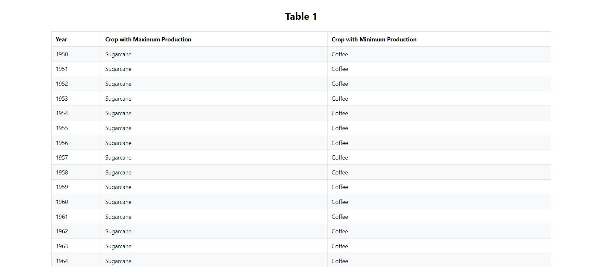
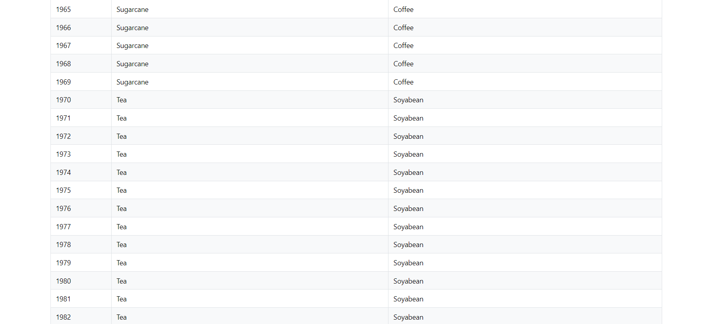
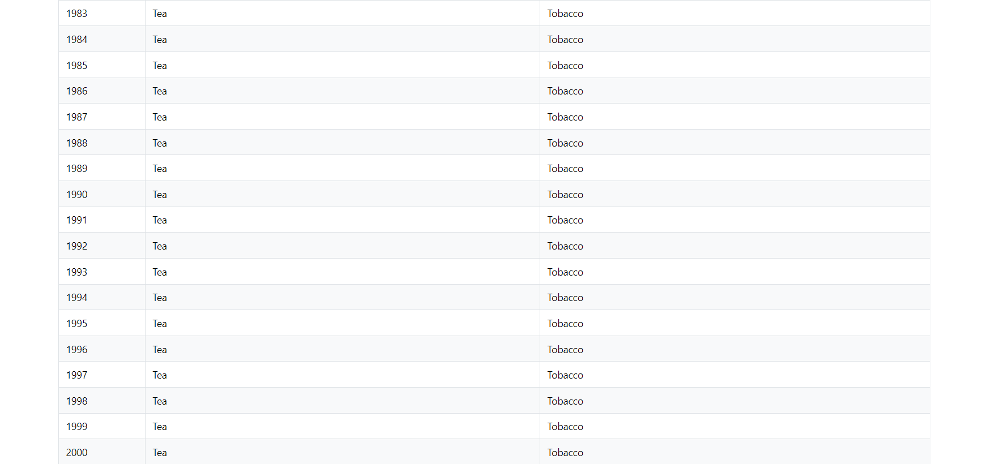
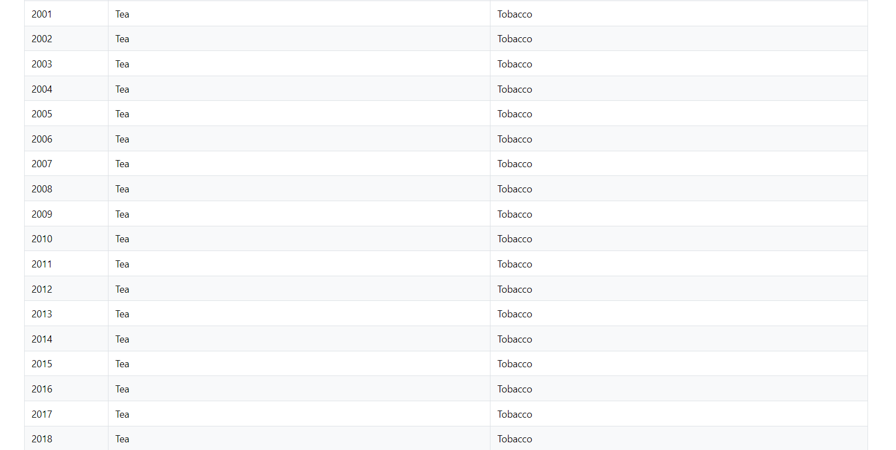
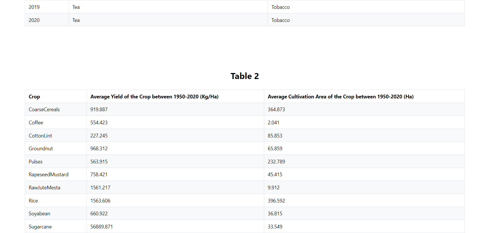
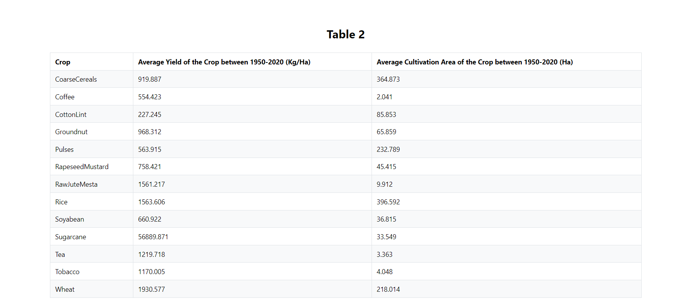

# MANUFAC Assessment.

A brief description of what this project does and who it's for

## Installation and Setup.
Step 1: Install Dependencies

To install the necessary dependencies for this project, run the following command:-

    yarn install

This command will install all required packages listed in the package.json file.

Step 2: Start the Development Server

Once you have installed the dependencies, you can start the development server by running:-

    yarn start

## Screenshots

